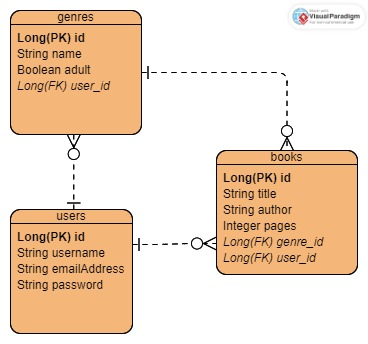

# springboot-mini-project
A small backend running on Tomcat using Spring Boot to create a REST API with H2 as the database.

Tools and Technologies Used
- Apache Tomcat Web Server
- Spring Boot Framework
- Spring JPA
- Spring Security
- JWT (JSON Web Token)
- H2 Database
- IntelliJ IDEA
- Visual Paradigm Online ERD Tool

ERD Diagram

User Stories
- As a User, I should be able to create an account, so that I can save my Genres and Books
- As a User, I should be able to login to my account, so that I can access my saved Genres and Books.
- As a User, I should be able to create and save Genres that I can group my favorite books by. 
- As a User, I should be able to update my saved Genres if I input the wrong descriptors.
- As a User, I should be able to retrieve a list of my saved Genres or a specific Genre.
- As a User, I should be able to delete a saved Genre if I don't like that Genre anymore.
- As a User, I should be able to create a representation of my favorite Books and their details under a specific Genre.
- As a User, I should be able to update the details of a Book.
- As a User, I should be able to retrieve all books or a specific Book under a certain category.
- As a User, I should be able to delete a saved Book if I don't want that Book anymore.

Planning Documentation
-Steps
1. Fill out readme
   - List out tools and technologies
   - Create ERD Diagram
   - Write User Stories
   - Note dependencies
2. Create Spring project
3. Set application properties
4. Create User, Genre, Book entities
   - Connect entities
5. Create Repositories and Service Layer
6. Create Controllers to handle endpoints
7. Implement JPA in project
8. Implement login and security with JWT
    - Add UserDetails and Authorities

Dependencies
- Add the following to pom.xml file
`<dependency>
  <groupId>org.springframework.boot</groupId>
  <artifactId>spring-boot-starter-security</artifactId>
</dependency>
 <dependency>
  <groupId>org.springframework.boot</groupId>
  <artifactId>spring-boot-starter-data-jpa</artifactId>
</dependency>
<dependency>
  <groupId>com.h2database</groupId>
  <artifactId>h2</artifactId>
  <scope>runtime</scope>
</dependency>
<dependency>
  <groupId>org.springframework.boot</groupId>
  <artifactId>spring-boot-devtools</artifactId>
  <scope>runtime</scope>
  <optional>true</optional>
</dependency>
<dependency>
  <groupId>org.springframework.boot</groupId>
  <artifactId>spring-boot-starter-web</artifactId>
</dependency>
<dependency>
  <groupId>org.springframework.boot</groupId>
  <artifactId>spring-boot-starter</artifactId>
</dependency>
<dependency>
  <groupId>org.springframework.boot</groupId>
  <artifactId>spring-boot-starter-test</artifactId>
  <scope>test</scope>
</dependency>
<dependency>
  <groupId>io.jsonwebtoken</groupId>
  <artifactId>jjwt-api</artifactId>
  <version>0.11.5</version>
</dependency>
<dependency>
  <groupId>io.jsonwebtoken</groupId>
  <artifactId>jjwt-impl</artifactId>
  <version>0.11.5</version>
  <scope>runtime</scope>
</dependency>
<dependency>
  <groupId>io.jsonwebtoken</groupId>
  <artifactId>jjwt-jackson</artifactId>
  <version>0.11.5</version>
  <scope>runtime</scope>
</dependency>`